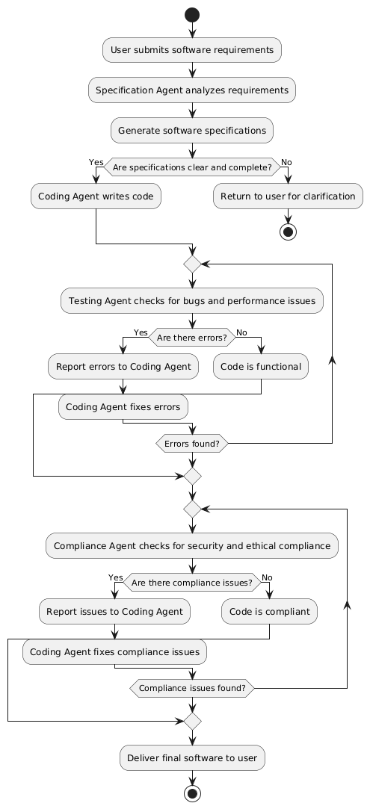

# Software Requirements Specification (SRS)

## 1. Scope of Project
The project aims to design and implement a **multi-agent AI system** for software development. The system will consist of specialized AI agents collaborating to analyze requirements, generate code, test, optimize, and ensure compliance. The focus is on seamless communication, task coordination, and efficiency across multiple AI models. Different architectures for AI agents will be investigated to determine the most effective approach.

## 2. Functional Requirements
- **Requirement Analysis**: An AI agent analyzes user requirements and generates software specifications.
- **Code Generation**: A specialized AI agent writes code based on the specifications.
- **Code Review**: Another AI agent reviews the generated code for errors and optimizations.
- **Testing**: An AI agent tests the software for functionality and performance.
- **Compliance Check**: An AI agent ensures the software adheres to security and ethical standards.
- **Communication**: AI agents share data and coordinate tasks efficiently using frameworks like LangGraph or AutoGen.
- **Hallucination Measurement**: The system will include mechanisms to measure hallucinations in AI outputs to determine trustworthiness and reliability.

## 3. Non-Functional Requirements
- **Performance**: The system should minimize computational costs and latency.
- **Scalability**: The system should handle multiple tasks and agents without degradation in performance.
- **Reliability**: The system should avoid conflicting or redundant outputs between agents.
- **Efficiency**: Optimize model calls and workloads to reduce redundancy.
- **Deployment**: The system should be deployable using distributed systems like Kubernetes or Docker Swarm.
- **Architecture Investigation**: Different architectures for AI agents will be explored to identify the most efficient and effective design.

## 4. Use Case Diagram
- **Actors**: User, AI Agents (Specification Agent, Coding Agent, Testing Agent, Compliance Agent).
- **Use Cases**:
  - User submits software requirements.
  - Specification Agent generates software specifications.
  - Coding Agent writes code based on specifications.
  - Testing Agent reviews and tests the code.
  - Compliance Agent ensures adherence to standards.
  - AI Agents communicate and coordinate tasks.

---

**Note**: This is a **preliminary version** of the SRS document and will be refined further as the project progresses and more details are finalized.

